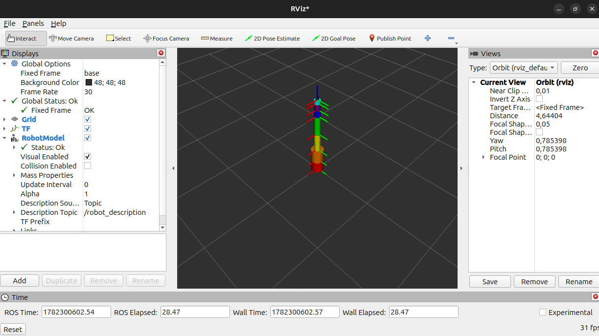
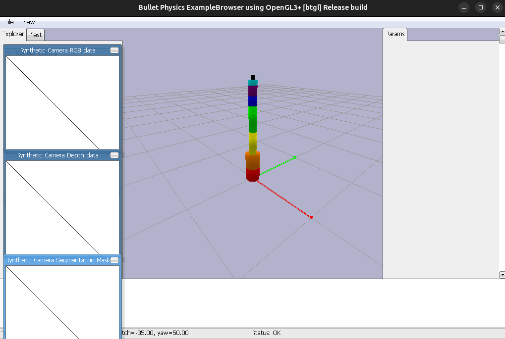
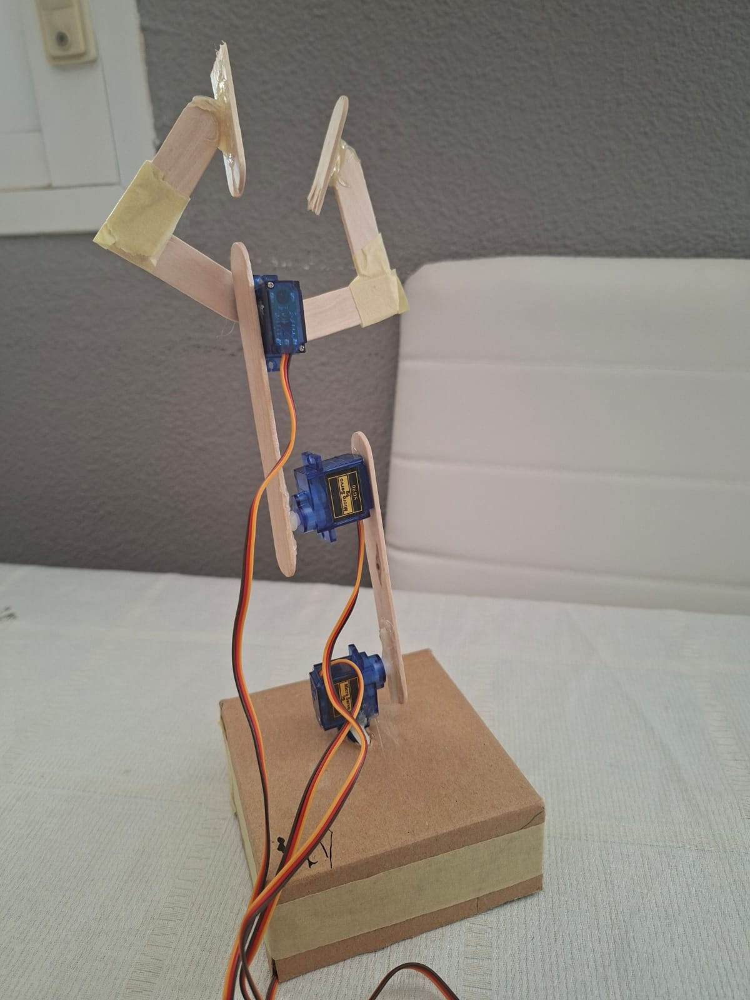

# Manual de uso — Plataforma SURI

---

## Índice

1. [Introducción a SURI](#1-introducción-a-suri)
   - [1.1 ¿Qué es la plataforma SURI?](#11-qué-es-la-plataforma-suri)
   - [1.2 Enfoques de uso: Usuario y desarrollador](#12-enfoques-de-uso-usuario-y-desarrollador)
   - [1.3 Modos de simulación: Virtual y físico](#13-modos-de-simulación-virtual-y-físico)
   - [1.4 Tecnologías empleadas](#14-tecnologías-empleadas)
   - [Arquitectura del sistema](#arquitectura-del-sistema)
2. [Primeros pasos y configuración](#2-primeros-pasos-y-configuración)
   - [2.1 Requisitos del sistema](#21-requisitos-del-sistema)
   - [2.2 Instalación y compilación del entorno](#22-instalación-y-compilación-del-entorno)
   - [2.3 Ejecución del código base](#23-ejecución-del-código-base)
   - [2.4 Entendiendo la interfaz gráfica](#24-entendiendo-la-interfaz-gráfica)
   - [2.5 Interfaz HMI y control del robot físico](#25-interfaz-hmi-y-control-del-robot-físico)
3. [Metodología de uso](#3-metodología-de-uso)
   - [3.1 Modo comandos (ejecución vía terminal)](#31-modo-comandos-ejecución-vía-terminal)
   - [3.2 Modo rutina (ejecución de archivos .yaml)](#32-modo-rutina-ejecución-de-archivos-yaml)
4. [Pruebas y casos de uso prácticos](#4-pruebas-y-casos-de-uso-prácticos)
   - [4.1 Movimientos cinemáticos básicos](#41-movimientos-cinemáticos-básicos)
   - [4.2 Posición segura: HOME](#42-posición-segura-home)
   - [4.3 Mover articulaciones por separado](#43-mover-articulaciones-por-separado)
   - [4.4 Gestión de herramientas: Añadir y probar un nuevo TCP](#44-gestión-de-herramientas-añadir-y-probar-un-nuevo-tcp)
   - [4.5 Gestión de colisiones: Creación de paredes virtuales](#45-gestión-de-colisiones-creación-de-paredes-virtuales)
   - [4.6 Caso de estudio avanzado: Jugar al 3 en raya](#46-caso-de-estudio-avanzado-jugar-al-3-en-raya)
     - [4.6.1 Configuración del entorno y machine learning (PyTorch)](#461-configuración-del-entorno-y-machine-learning-pytorch)
     - [4.6.2 Configuración de la visión (cámaras y tablero)](#462-configuración-de-la-visión-cámaras-y-tablero)
     - [4.6.3 Ejecución de la partida e interacción](#463-ejecución-de-la-partida-e-interacción)
5. [Lista de comandos](#5-lista-de-comandos)
   - [5.1 Comandos de terminal](#51-comandos-de-terminal)
     - [5.1.1 Movimientos del robot](#511-movimientos-del-robot)
     - [5.1.2 Entorno y colisiones](#512-entorno-y-colisiones)
     - [5.1.3 Configuración de herramientas (TCP)](#513-configuración-de-herramientas-tcp)
     - [5.1.4 Cámaras y objetos](#514-cámaras-y-objetos)
     - [5.1.5 Módulo 3 en raya (DLC)](#515-módulo-3-en-raya-dlc)
   - [5.2 Rutinas (.yaml)](#52-rutinas-yaml)
     - [5.2.1 Cómo ejecutar una rutina](#521-cómo-ejecutar-una-rutina)
     - [5.2.2 Estructura de una rutina](#522-estructura-de-una-rutina)
     - [5.2.3 Movimientos del robot](#523-movimientos-del-robot)
     - [5.2.4 Entorno y colisiones](#524-entorno-y-colisiones)
     - [5.2.5 Configuración de herramientas (TCP)](#525-configuración-de-herramientas-tcp)
6. [Guía básica para desarrolladores](#6-guía-básica-para-desarrolladores)
   - [6.1 Cómo cambiar el modelo del robot](#61-cómo-cambiar-el-modelo-del-robot)
   - [6.2 Comunicación serial con el robot físico](#62-comunicación-serial-con-el-robot-físico)
   - [6.3 Añadir funcionalidades y módulos adicionales (DLCs)](#63-añadir-funcionalidades-y-módulos-adicionales-dlcs)
7. [Anexos](#7-anexos)

---

## 1. Introducción a SURI

### 1.1 ¿Qué es la plataforma SURI?

**SURI** (Simulación Universal para Robótica Industrial) es una plataforma de simulación, control y aprendizaje para brazos robóticos. Tiene una interfaz amigable para el usuario y una escalabilidad grande que permite a los estudiantes seguir formándose y crear nuevas funcionalidades. Lo que diferencia a esta plataforma de otras es que gracias a su diseño modular hace que se pueda cambiar, añadir o eliminar configuraciones muy cómodamente sin afectar al resto del programa.

Una de las características más destacadas es la facilidad de cambiar el robot. No se necesita una configuración o conocimientos muy avanzados. Tan solo el `urdf` del robot, que se puede encontrar en internet o crear uno propio.

---

### 1.2 Enfoques de uso: Usuario y desarrollador

Este proyecto tiene dos enfoques de uso:

- **Usuario:** Proporciona una interfaz de alto nivel enfocada en la usabilidad. Permite enviar comandos intuitivos (movimiento de coordenadas, control de pinzas) y visualizar la ejecución en tiempo real sin necesidad de un alto conocimiento en robótica. Enfocado al uso de las funcionalidades ya preprogramadas.

- **Desarrollador:** Ofrece una base de código modular diseñada para ser ampliada. Permite desde programar e integrar nuevas funcionalidades a medida, hasta cambiar el modelo del robot por completo de forma ágil y sin reestructurar el sistema, adaptándose a las necesidades de cualquier proyecto incluso añadiendo nuevos DLCs.

---

### 1.3 Modos de simulación: Virtual y físico

Este proyecto tiene varias maneras de ejecutarse:

- **Solo virtual:** Todo será virtual mediante PyBullet, que simulará todos los movimientos del robot con la escena (objetos, cámaras…) necesaria. Perfecto para hacer pruebas y validación.

- **Solo real:** Permite controlar el robot sólo físicamente mediante Arduino; en el ordenador solo se verán mensajes de depuración o información, no se verá ninguna simulación. Útil para puesta en producción o si se prefiere trabajar más el aspecto físico y mecánico que el software.

- **Híbrido:** Funciona tanto real como virtual, haciendo que la simulación funcione como un gemelo digital a tiempo real. Perfecto para comprobar que todo funciona bien; permite visualización para depurar y manejo real del robot.

Gracias a su estructura modular permite que se pueda funcionar de varias maneras y añadir funcionalidades sin problema.

---

### 1.4 Tecnologías empleadas

Para lograr que SURI sea accesible, modular y no requiera un superordenador, se ha seleccionado cuidadosamente las tecnologías base. Cada pieza cumple una función específica y ha sido elegida pensando en mantener una curva de aprendizaje amigable y fluida.

### Arquitectura del sistema

| Componente | Tecnología | Función |
|---|---|---|
| Motor de Físicas y Simulación | **PyBullet** | En modo `DIRECT`: cerebro matemático para cinemática, singularidades y colisiones. En modo `GUI`: renderiza el gemelo digital en tiempo real. |
| Control y Comunicaciones | **ROS 2 Jazzy** | Sistema nervioso de la plataforma; comunica todos los módulos, gestiona herramientas, rutinas y casos de uso avanzados. |
| Motor de Hardware | **Arduino** | Controla el brazo robótico físico; actúa como puente entre ROS 2 (por USB) y los motores. |

De esta manera, se obtiene una plataforma con una curva de aprendizaje baja, que no requiere de grandes inversiones económicas ni ordenadores de última generación, siendo a la vez muy flexible, modular y fácilmente personalizable.

---

## 2. Primeros pasos y configuración

Esta sección es una guía del proceso de instalación, compilación y puesta en marcha de la plataforma. El objetivo es dejar el entorno completamente operativo en el equipo local.

### 2.1 Requisitos del sistema

Para que SURI funcione correctamente, es necesario tener instalados los siguientes componentes en la máquina local. En caso de usar Windows, es posible ejecutarlo utilizando el subsistema de Linux (WSL2):

- **Sistema Operativo:** Ubuntu 24.04 (Nativo o en WSL2).
- **ROS 2 Jazzy:** El núcleo de comunicaciones de la plataforma.
- **PyBullet:** Para el entorno del simulador de físicas.
- **RViz2:** Normalmente se instala automáticamente con la versión Desktop de ROS 2.
- **Arduino IDE:** Necesario para compilar y subir el código al controlador del robot físico.

---

### 2.2 Instalación y compilación del entorno

Para empezar, se requiere descargar el código fuente y compilar el espacio de trabajo de ROS 2. Hay que abrir una terminal y ejecutar las siguientes líneas una a una:

```bash
# 1. Clonar el repositorio
git clone https://github.com/SilCalvo/TFG.git

# 2. Entrar en la carpeta del espacio de trabajo (workspace)
cd TFG/src/ros2_ws

# 3. Compilar los paquetes de ROS 2
colcon build

# 4. Cargar el entorno para que la terminal reconozca los comandos
source install/setup.bash
```

> **Nota:** El paso 4 (`source install/setup.bash`) debe ejecutarse cada vez que se abra una terminal nueva, a menos que se añada al archivo `.bashrc` del sistema.

---

### 2.3 Ejecución del código base

Existen diferentes formas de lanzar el código de SURI dependiendo de las necesidades. Se debe elegir el modo de ejecución que mejor se adapte al objetivo en cada momento.

- **Solo Físico:** Ideal cuando el robot ya está en producción y no se necesita simulador.

  ```bash
  ros2 launch robot_pkg robot_real.launch.py
  ```

- **Solo Virtual:** Perfecto para hacer pruebas y validar trayectorias sin riesgo de colisiones reales.

  ```bash
  ros2 launch robot_pkg simulation.launch.py
  ```

- **Híbrido (Gemelo Digital):** Conecta el robot físico con la simulación en tiempo real.

  ```bash
  ros2 launch robot_pkg hibrid.launch.py
  ```

---

**AVISO**: Una vez ejecutado el comando, no se podrán ejecutar nuevos comandos en esa terminal, es necesario abrir una nueva.


**RECOMENDACIÓNN**: Cada vez que se abra una terminal nueva ejecutar: 
```bash
cd TFG/src/ros2_ws
```

### 2.4 Entendiendo la interfaz gráfica

Al lanzar la simulación, se trabajará con dos ventanas principales que tienen propósitos muy distintos:

#### 2.4.1 RViz: Visualización de ejes, TFs y modelo del robot

Aquí no se muestra un entorno fotorrealista. RViz visualiza el estado del robot. Es la herramienta ideal para:

- Ver los ejes de coordenadas (Frames/TFs).
- Planificar trayectorias.
- Observar la estructura cinemática.
- Depurar el funcionamiento interno de ROS 2.



#### 2.4.2 PyBullet: El gemelo digital

En esta ventana se muestra un entorno en el que se pueden observar las paredes virtuales, introducir objetos en escena, ver cámaras RGBD, etc. Se mueve al recibir los comandos, que los recibe a la vez que el robot real.



---

### 2.5 Interfaz HMI y control del robot físico

La plataforma SURI permite el control de un brazo robótico físico mediante un panel de control o interfaz HMI (Human-Machine Interface) gestionado por una placa Arduino.

**Montaje y configuración inicial:** Para el ensamblaje del robot real, se deben seguir las instrucciones detalladas en el [vídeo de montaje](https://www.youtube.com/watch?v=JBl7gwf7ORU) (Se puede ver una foto del robot fisico al final de esta sección). La única modificación respecto al diseño del vídeo original es la sustitución del motor paso a paso por un servomotor **MSG90**. Es importante recordar que las dimensiones de esta modificación deben actualizarse en el archivo `.urdf`. El esquema eléctrico completo para realizar las conexiones se encuentra disponible en el apartado de [Anexos](#6-anexos).

**Controles físicos:** El panel está diseñado para facilitar el manejo manual y la interacción con la simulación. Sus componentes principales son:

- **Potenciómetros:** Permiten mover cada articulación de forma independiente. El sistema interpola los datos de lectura de cada potenciómetro para traducirlos exactamente a los grados de movimiento de los servomotores.

- **Botonera (3 botones):**
  - Botón para activar el **Modo Automático** (control del robot desde el ordenador).
  - Botón para activar el **Modo Manual** (control físico mediante los potenciómetros).
  - Botón de **Envío de puntos** (pared virtual): al operar en modo manual, pulsar este botón envía las coordenadas actuales del robot al sistema.

- **Indicadores visuales (LEDs):** El panel dispone de un sistema de iluminación para identificar rápidamente el estado operativo del robot:
  - **LED Azul:** Se mantiene encendido cuando el Modo Automático está activo.
  - **LED Amarillo:** Se mantiene encendido cuando el Modo Manual está activo.
  - **LED Verde:** Emite un parpadeo como confirmación visual cada vez que se guarda un punto con el botón de envío.

**Sistema de suavizado de transición:** Una característica clave de la interfaz física es su mecanismo de seguridad al cambiar de Modo Automático a Modo Manual.

Durante el funcionamiento automático, el robot puede moverse a posiciones muy distintas a las que marcan los potenciómetros en ese momento. Si se cambiara al modo manual de forma directa, el robot intentaría corregir su posición de golpe, provocando un salto brusco. Para evitarlo, el sistema realiza una **transición suave**: mueve cada articulación gradualmente desde su posición actual hasta la posición que indican los potenciómetros.

Mientras este ajuste gradual se está llevando a cabo, los LEDs azul y amarillo permanecerán encendidos simultáneamente hasta que el robot finalice el movimiento y pase de forma definitiva al control manual.



---

## 3. Metodología de uso

La plataforma SURI ofrece dos metodologías principales para enviar instrucciones al robot. La elección entre una u otra dependerá de si se busca realizar pruebas puntuales o automatizar un proceso completo.

### 3.1 Modo comandos (ejecución vía terminal)

Este modo permite una interacción directa y manual con el sistema a través de la terminal de comandos.

Consiste en introducir las instrucciones de movimiento o acción una a una. Al ser un sistema de ejecución secuencial, el terminal queda a la espera y no permite procesar un nuevo comando hasta que el robot haya finalizado por completo la acción anterior.

> La lista completa y la sintaxis de estos comandos se detallan más adelante, en la Sección 5.

**¿Para qué se recomienda?** Es el método ideal para la **validación y el diagnóstico**. Resulta muy útil para probar coordenadas específicas, verificar el alcance del brazo robótico o confirmar que una acción hace exactamente lo que se espera antes de integrarla en un proceso más largo.

---

### 3.2 Modo rutina (ejecución de archivos .yaml)

Este modo está diseñado para la **automatización de tareas**. En lugar de escribir los comandos uno a uno, el sistema lee y ejecuta de forma secuencial una lista de instrucciones predefinidas guardadas en un archivo de configuración con formato `.yaml`.

Para crear y ejecutar una rutina, los archivos `.yaml` deben alojarse en el directorio correspondiente del proyecto:

```
robot_ws/src/robot_pkg/rutines/
```

> **Recomendación de seguridad:** Antes de ejecutar una rutina completa por primera vez, es altamente recomendable probar los comandos y las posiciones clave por separado utilizando el Modo Comandos. Esto garantiza que las trayectorias son seguras, físicamente posibles para el robot y que no existen riesgos de colisión en el entorno.

---

## 4. Pruebas y casos de uso prácticos

Una vez configurado el entorno, es el momento de poner a prueba el sistema. En esta sección se detallan las operaciones fundamentales que puede realizar el brazo robótico, desde movimientos básicos hasta la integración de inteligencia artificial.

### 4.1 Movimientos cinemáticos básicos

El brazo robótico puede planificar sus trayectorias de diferentes maneras. Es fundamental entender la diferencia entre los dos tipos de movimiento principales:

| Tipo | Descripción | Cuándo usarlo | Cuándo NO usarlo |
|---|---|---|---|
| **MoveJ** (Movimiento Articular) | El robot calcula la forma más rápida de llegar al destino; la orientación del TCP va cambiando a lo largo del trayecto. | Movimientos rápidos con el robot vacío. | Si el robot transporta algo que debe mantenerse nivelado (ej. un vaso lleno de líquido). |
| **MoveL** (Movimiento Lineal) | El robot traza una línea recta perfecta manteniendo la orientación fija del TCP en todo momento. | Cuando se requiere precisión de trayectoria y orientación constante. | Cuando la trayectoria recta pasa por una singularidad cinemática; en ese caso el movimiento se cancelará por seguridad. |


**COMANDOS**

```bash
ros2 action send_goal /moveJ nav2_msgs/action/NavigateToPose "{pose: {header: {frame_id: 'base'}, pose: {position: {x: -0.4, y: 0.0, z: 0.3}, orientation: {x: 0.0, y: 1.0, z: 0.0, w: 0.0}}}}"
```
```bash
ros2 action send_goal /moveJ nav2_msgs/action/NavigateToPose "{pose: {header: {frame_id: 'base'}, pose: {position: {x: -0.2, y: 0.0, z: 1.1}, orientation: {x: 0.0, y: 0.0, z: 0.0, w: 1.0}}}}"
```
```bash
ros2 action send_goal /moveL nav2_msgs/action/NavigateToPose "{pose: {header: {frame_id: 'base'}, pose: {position: {x: 0.3, y: 0.0, z: 1.1}, orientation: {x: 0.0, y: 0.0, z: 0.0, w: 1.0}}}}"
```
**RUTINA**

```bash
ros2 run robot_pkg rutine_node
```


---

### 4.2 Posición segura: HOME

Uno de los pasos más importantes en cualquier rutina es establecer una posición de **Home** o reposo seguro (generalmente con el brazo robótico completamente extendido hacia arriba).

Esta posición no solo sirve para guardar el robot, sino que actúa como un **"reseteo" mecánico**. Muchos servomotores pueden girar más de 360 grados; aunque visualmente parezca que el robot está en una postura normal, internamente el motor podría estar al borde de su límite de giro físico o a punto de tensar los cables. Enviar el robot a la posición HOME asegura que todos los contadores de las articulaciones se reinicien, garantizando que el siguiente movimiento parta de un estado seguro y conocido.


**COMANDOS**

```bash
ros2 action send_goal /moveJ nav2_msgs/action/NavigateToPose "{pose: {header: {frame_id: 'base'}, pose: {position: {x: -0.4, y: 0.0, z: 0.3}, orientation: {x: 0.0, y: 1.0, z: 0.0, w: 0.0}}}}"

```

```bash
ros2 service call /go_home robot_interfaces/srv/MoveJoint "{index: 0, degrees: 0.0}"

```


```bash
ros2 action send_goal /moveJ nav2_msgs/action/NavigateToPose "{pose: {header: {frame_id: 'base'}, pose: {position: {x: -0.4, y: 0.0, z: 0.3}, orientation: {x: 0.0, y: 1.0, z: 0.0, w: 0.0}}}}"

```

**RUTINA**

```bash
ros2 run robot_pkg rutine_node --ros-args -p archivo:="test_go_home.yaml"
```
---

### 4.3 Mover articulaciones por separado

Si se requiere un control más fino o depurar un motor específico, es posible mover cada articulación de forma individual.

Para ello, basta con seleccionar el **índice de la articulación** (la numeración empieza en `0` para la base y va subiendo hasta la punta) e introducir los grados a los que se desea que gire (generalmente en un rango de `0` a `180` grados, dependiendo del motor).


**COMANDOS**

```bash
ros2 service call /control_joint robot_interfaces/srv/MoveJoint "{index: 2, degrees: 45.0}"

```
```bash
ros2 service call /control_joint robot_interfaces/srv/MoveJoint "{index: 1, degrees: 45.0}"

```
```bash
ros2 service call /control_joint robot_interfaces/srv/MoveJoint "{index: 4, degrees: 70.0}"

```
**RUTINA**

```bash
ros2 run robot_pkg rutine_node --ros-args -p archivo:="test_move_articulations.yaml"
```
---

### 4.4 Gestión de herramientas: Añadir y probar un nuevo TCP

El **TCP** (Tool Center Point o Punto Central de la Herramienta) es el punto exacto de la herramienta que el robot utiliza para interactuar con el entorno. Para el sistema de control, este punto virtual es el verdadero final del brazo robótico, y todos los cálculos matemáticos de movimiento y orientación se realizan tomando exclusivamente este punto de referencia.

La plataforma SURI es altamente modular y permite añadir, cambiar o eliminar herramientas en plena ejecución. Sin embargo, al cambiar de herramienta cambian sus dimensiones. Para que el robot se mueva con precisión geométrica y no choque, se debe actualizar la configuración para reubicar el TCP en el nuevo extremo exacto de interacción:

- Si se usa un **rotulador**, el TCP debe definirse exactamente en la punta que tocará el papel.
- Si se usa una **pinza** (gripper), el TCP debe establecerse en el espacio central exacto donde los dedos agarran el objeto.


**COMANDOS**

```bash
ros2 action send_goal /moveJ nav2_msgs/action/NavigateToPose "{pose: {header: {frame_id: 'base'}, pose: {position: {x: -0.4, y: 0.0, z: 0.3}, orientation: {x: 0.0, y: 1.0, z: 0.0, w: 0.0}}}}"
```
```bash
ros2 service call /add_tool robot_interfaces/srv/ManageTool "{name: 'pinza', type: 1, dimensions: [0.20, 0.05], offset: {position: {z: 0.0}, orientation: {w: 1.0}}}"
```
```bash
ros2 param set /move_arm_node active_tool "pinza"
```

```bash
ros2 action send_goal /moveJ nav2_msgs/action/NavigateToPose "{pose: {header: {frame_id: 'base'}, pose: {position: {x: -0.4, y: 0.0, z: 0.3}, orientation: {x: 0.0, y: 1.0, z: 0.0, w: 0.0}}}}"
```


Se puede observar cómo el brazo baja la diferencia de 0.10 que es la diferencia del tamaño de las herramientas.


```bash
ros2 param set /move_arm_node active_tool "default"
```

**RUTINA**
```bash
ros2 run robot_pkg rutine_node --ros-args -p archivo:="test_tcp.yaml"
```

Se puede observar como el brazo baja la diferencia de 0.15 que es la diferencia del tamaño de las herramientas.

---

### 4.5 Gestión de colisiones: Creación de paredes virtuales

La seguridad es el factor más crítico en robótica. Tradicionalmente, esto se soluciona instalando una celda física de metal alrededor del robot; si un humano entra, la máquina se apaga de golpe. Sin embargo, esto requiere construcción física, ocupa espacio y anula la interactividad.

SURI utiliza un enfoque mucho más moderno: las **paredes virtuales** (geofencing). El sistema permite crear barreras invisibles en la escena 3D que el robot tiene prohibido atravesar bajo cualquier circunstancia. La gran ventaja es su flexibilidad:

- Las paredes se pueden **añadir, modificar o eliminar en tiempo real** durante la ejecución.
- Garantizan que un usuario siempre estará seguro al otro lado de la barrera virtual.
- No requieren instalaciones físicas costosas.
- Permiten que el entorno de trabajo cambie dinámicamente.

Para ver como funcionan las paredes virtuales se muestra el siguiente ejemplo, en el cual, primero mueve al robot a una posición para que se vea que llega sin problemas.

Después de poner la pared virtual en su camino, se puede comprobar que el robot ya no puede ir a esa misma posición.

Esta restricción la se puede ver directamente por la terminal del código base, que mostrará un mensaje de salida: COLISION.

**COMANDOS**

```bash
ros2 action send_goal /moveJ nav2_msgs/action/NavigateToPose "{pose: {header: {frame_id: 'base'}, pose: {position: {x: 0.6, y: 0.0, z: 0.9}, orientation: {x: 0.707, y: 0.0, z: 0.707, w: 0.0}}}}"
```

```bash
ros2 service call /go_home robot_interfaces/srv/MoveJoint "{index: 0, degrees: 0.0}"
```

Como la pared virtual se asegura que el end effector es el que no atraviese la pared, pondremos una herramienta más grande para comprobar su funcionamiento


```bash
ros2 service call /add_tool robot_interfaces/srv/ManageTool "{name: 'pinza', type: 1, dimensions: [0.2, 0.05], offset: {position: {z: 0.0}, orientation: {w: 1.0}}}"
```

```bash
ros2 param set /move_arm_node active_tool "pinza"
```

```bash
ros2 service call /add_wall robot_interfaces/srv/AddObstacle "{                                                                                                                                        
  name: 'pared_frontal',
  x: 0.5,
  y: 0.0,
  z: 0.0,
  roll: 0.0,
  pitch: 0.0,
  yaw: 0.0,
  width: 0.02,
  height: 3.0,
  depth: 0.8
}"

```

Puedes observar la pared virtual en pybullet 


```bash
ros2 action send_goal /moveJ nav2_msgs/action/NavigateToPose "{pose: {header: {frame_id: 'base'}, pose: {position: {x: 0.6, y: 0.0, z: 0.9}, orientation: {x: 0.707, y: 0.0, z: 0.707, w: 0.0}}}}"
```

```bash
ros2 service call /remove_wall robot_interfaces/srv/RemoveObstacle "{name: 'pared_frontal'}"
```
```bash
ros2 action send_goal /moveJ nav2_msgs/action/NavigateToPose "{pose: {header: {frame_id: 'base'}, pose: {position: {x: 0.6, y: 0.0, z: 0.9}, orientation: {x: 0.707, y: 0.0, z: 0.707, w: 0.0}}}}"
```

**RUTINA**
```bash
ros2 run robot_pkg rutine_node --ros-args -p archivo:="test_wall.yaml"
```

**AVISO:** La rutina dará fallo ya que intentará ir a una posición inalcanzable por colisión. Es correcto, esto demuestra que las rutinas deben ser depuradas con anterioridad o pararán su ejecución.

---

### 4.6 Caso de estudio avanzado: Jugar al 3 en raya

Para demostrar la capacidad de SURI al integrar robótica, visión artificial y toma de decisiones, se ha incluido un módulo adicional (DLC) que permite jugar partidas de **3 en raya** (Tic-Tac-Toe) contra el robot.

La ejecución de este caso requiere configurar varios elementos del entorno:

#### 4.6.1 Configuración del entorno y machine learning (PyTorch)

Para que el robot sea capaz de distinguir entre una "X" y una "O", se utiliza un modelo ligero de Inteligencia Artificial (Machine Learning) que clasifica las piezas visualmente. Para evitar problemas de compatibilidad y facilitar su uso, se ha preparado un entorno virtual de Python que contiene todas las librerías necesarias (como PyTorch).

Para activar el entorno y cargar el modelo de clasificación, ejecuta **en una terminal nueva**:

```bash
chmod +x src/tic_tac_toe_dlc/launch/init_python.sh
./src/tic_tac_toe_dlc/launch/init_python.sh
```

#### 4.6.2 Configuración de la visión (cámaras y tablero)

El siguiente paso es añadir la escena de juego. Esto despliega el tablero virtual y posiciona una cámara RGB-D. El uso de este tipo de cámara es clave: captura los colores para identificar las piezas y utiliza la **profundidad (Depth)** para calcular la distancia exacta a la que se encuentran en el espacio 3D.

Para cargar el tablero y la cámara en la simulación, ejecuta **en una terminal nueva**:


```bash
# Añadir la cámara:
ros2 service call /add_camera robot_interfaces/srv/AddCamera \
  "{name: 'camara_tablero', x: 0.35, y: 0.01, z: 0.45, \
    target_x: 0.35, target_y: 0.0, target_z: 0.0, \
    width: 640, height: 480}"
```

```bash
# Añadir el tablero:
ros2 service call /add_object robot_interfaces/srv/SpawnObject \
  "{name: 'tablero_principal', package_name: 'tic_tac_toe_dlc', \
    piece_type: 'tablero', x: 0.35, y: 0.0, z: 0.0}"
```

#### 4.6.3 Ejecución de la partida e interacción

Una vez que el entorno físico, la visión y la inteligencia artificial están funcionando, se puede iniciar el bucle del juego. El sistema analizará el estado del tablero mediante la cámara, decidirá su próximo movimiento y el brazo robótico colocará su pieza.

Para lanzar el juego ejecuta en **una terminal nueva**:

```bash
# Lanzar el juego:
ros2 launch tic_tac_toe_dlc init_game.launch.py
```
Para colocar una ficha ejecuta en **una terminal nueva**:

```bash
# Colocar ficha (ejemplo: fila 1, columna 1):
ros2 service call /put_piece_virtual robot_interfaces/srv/PutPiece \
  "{fila: 1, columna: 1}"
```

---

## 5. Lista de comandos

Esta sección recoge todos los comandos disponibles en la plataforma SURI, tanto para su uso directo desde la terminal como para incluirlos en archivos de rutina `.yaml`.

---

### 5.1 Comandos de terminal

#### 5.1.1 Movimientos del robot

- **`moveJ`** — Movimiento articular a una pose cartesiana.

  ```bash
  ros2 action send_goal /moveJ nav2_msgs/action/NavigateToPose "{pose: {header: {frame_id: 'base'}, pose: {position: {x: -0.4, y: 0.0, z: 0.3}, orientation: {x: 0.0, y: 1.0, z: 0.0, w: 0.0}}}}"
  ```

- **`moveL`** — Movimiento lineal cartesiano a una pose.

  ```bash
  ros2 action send_goal /moveL nav2_msgs/action/NavigateToPose "{pose: {header: {frame_id: 'base'}, pose: {position: {x: 0.3, y: 0.0, z: 1.1}, orientation: {x: 0.0, y: 0.0, z: 0.0, w: 1.0}}}}"
  ```

- **`control_joint`** — Mueve una articulación concreta a un ángulo.

  ```bash
  ros2 service call /control_joint robot_interfaces/srv/MoveJoint "{index: 2, degrees: 45.0}"
  ```

- **`go_home`** — Devuelve el robot a la posición de reposo.

  ```bash
  ros2 service call /go_home robot_interfaces/srv/MoveJoint "{index: 0, degrees: 0.0}"
  ```

---

#### 5.1.2 Entorno y colisiones

- **`add_wall`** — Crea una pared virtual de colisión.

  ```bash
  ros2 service call /add_wall robot_interfaces/srv/AddObstacle "{
    name: 'pared_frontal',
    x: 0.5,
    y: 0.0,
    z: 0.0,
    roll: 0.0,
    pitch: 0.0,
    yaw: 0.0,
    width: 0.02,
    height: 3.0,
    depth: 0.8
  }"
  ```

- **`remove_wall`** — Elimina una pared virtual existente.

  ```bash
  ros2 service call /remove_wall robot_interfaces/srv/RemoveObstacle "{name: 'pared_frontal'}"
  ```

---

#### 5.1.3 Configuración de herramientas (TCP)

- **`add_tool`** — Define un nuevo TCP (herramienta).

  ```bash
  ros2 service call /add_tool robot_interfaces/srv/ManageTool "{name: 'pinza', type: 1, dimensions: [0.11, 0.05], offset: {position: {z: 0.0}, orientation: {w: 1.0}}}"
  ```

- **`delete_tool`** — Elimina la definición de una herramienta.

  ```bash
  ros2 service call /add_tool robot_interfaces/srv/ManageTool "{name: 'pinza', type: 1, dimensions: 0, offset: 0}"
  ```

- **`set_tool`** — Cambia la herramienta activa del sistema.

  ```bash
  ros2 param set /move_action_server active_tool "pinza"
  ```

---

#### 5.1.4 Cámaras y objetos

- **`add_camera`** — Añade una cámara RGB-D a la escena de simulación.

  ```bash
  ros2 service call /add_camera robot_interfaces/srv/AddCamera \
    "{name: 'camara_tablero', x: 0.35, y: 0.01, z: 0.45, \
      target_x: 0.35, target_y: 0.0, target_z: 0.0, \
      width: 640, height: 480}"
  ```

- **`add_object`** — Carga un objeto o modelo en la escena de simulación.

  ```bash
  ros2 service call /add_object robot_interfaces/srv/SpawnObject \
    "{name: 'tablero_principal', package_name: 'tic_tac_toe_dlc', \
      piece_type: 'tablero', x: 0.35, y: 0.0, z: 0.0}"
  ```

---

#### 5.1.5 Módulo 3 en raya (DLC)

- **`init_python`** — Activa el entorno virtual de Python con PyTorch para el modelo de clasificación.

  ```bash
  chmod +x src/tic_tac_toe_dlc/launch/init_python.sh
  ./src/tic_tac_toe_dlc/launch/init_python.sh
  ```

- **`init_game`** — Lanza el bucle principal del juego 3 en Raya.

  ```bash
  ros2 launch tic_tac_toe_dlc init_game.launch.py
  ```

- **`put_piece_virtual`** — Coloca una ficha del robot en una celda del tablero.

  ```bash
  ros2 service call /put_piece_virtual robot_interfaces/srv/PutPiece \
    "{fila: 1, columna: 1}"
  ```

---

### 5.2 Rutinas (.yaml)

Las rutinas nuevas deben guardarse en `robot_ws/src/robot_pkg/rutines/` en un archivo `.yaml`.

#### 5.2.1 Cómo ejecutar una rutina

Para lanzar el nodo de rutinas y ejecutar un archivo `.yaml` concreto:

```bash
# Ejecutar una rutina específica:
ros2 run robot_pkg rutine_node --ros-args -p archivo:="nombre_rutina.yaml"

# Ejecutar sin especificar archivo (usa el archivo por defecto):
ros2 run robot_pkg rutine_node
```

---

#### 5.2.2 Estructura de una rutina

```yaml
rutina:
  - tipo: "moveJ"
    x: -0.4
    y: 0.0
    z: 0.3
    qx: 0.0
    qy: 1.0
    qz: 0.0
    qw: 0.0

  - tipo: "go_home"
    index: 0
    degrees: 0.0
```

#### 5.2.3 Movimientos del robot

| Comando | Descripción | Parámetros |
|---|---|---|
| **`moveJ`** | Movimiento articular a una pose cartesiana. | `x`, `y`, `z`, `qx`, `qy`, `qz`, `qw` |
| **`moveL`** | Movimiento lineal cartesiano a una pose. | `x`, `y`, `z`, `qx`, `qy`, `qz`, `qw` |
| **`control_joint`** | Mueve una articulación concreta a un ángulo. | `index`, `degrees` |
| **`go_home`** | Devuelve el robot a la posición de reposo. | *Sin parámetros* |

#### 5.2.4 Entorno y colisiones

| Comando | Descripción | Parámetros |
|---|---|---|
| **`add_wall`** | Crea una pared virtual de colisión. | `name`, `x`, `y`, `z`, `width`, `depth`, `height` |
| **`remove_wall`** | Elimina una pared virtual existente. | `name` |

#### 5.2.5 Configuración de herramientas (TCP)

| Comando | Descripción | Parámetros |
|---|---|---|
| **`add_tool`** | Define un nuevo TCP (herramienta). | `name`, `tool_type`, `dimensions`, `off_x`, `off_y`, `off_z`, `off_qw` |
| **`delete_tool`** | Elimina la definición de una herramienta. | `name` |
| **`set_tool`** | Cambia la herramienta activa del sistema. | `name` |

---

## 6. Guía básica para desarrolladores

Esta sección está orientada a usuarios con un perfil técnico o desarrolladores que deseen escalar la plataforma. Aunque poseer conocimientos previos de ROS 2 facilita enormemente el proceso, la arquitectura modular de SURI está diseñada para que implementar modificaciones estructurales sea lo más intuitivo posible, evitando reescribir código complejo.

### 6.1 Cómo cambiar el modelo del robot

Una de las grandes ventajas de SURI es que, para cambiar el modelo cinemático y visual del robot, no es necesario alterar el motor matemático. El proceso consta de dos únicos pasos:

1. **Importar el modelo 3D:** Se debe colocar el archivo `.urdf` del nuevo brazo robótico en el directorio correspondiente y renombrarlo obligatoriamente como `robot.urdf`:

   ```
   src/ros2_ws/src/robot_pkg/urdf/robot.urdf
   ```

2. **Actualizar los parámetros:** Es necesario modificar el archivo de configuración para indicarle al sistema las características del nuevo brazo:

   ```
   src/ros2_ws/src/robot_pkg/config/robot_params.yaml
   ```

---

### 6.2 Comunicación serial con el robot físico

SURI utiliza Arduino por defecto para el control de los motores, pero su arquitectura es **independiente respecto al hardware**. Esto permite sustituir el microcontrolador por cualquier otro (como un ESP32, un STM32, etc.).

Para realizar este cambio, la única pieza de software que necesita ser adaptada es el nodo escrito en C++ que actúa como puente de comunicación serial entre ROS 2 y la placa física:

```
src/ros2_ws/src/robot_pkg/src/servo_bridge_node.cpp
```

Este nodo se encarga de abrir el puerto serie y establecer la velocidad de transmisión de datos. Por defecto, está configurado para operar a una velocidad de **57600 baudios** (`B57600`), coincidiendo con la configuración del código de Arduino. Si el nuevo microcontrolador utiliza una tasa de baudios diferente o se conecta en un puerto distinto, bastará con localizar y ajustar estos dos parámetros en el código y volver a compilar el entorno.

---

### 6.3 Añadir funcionalidades y módulos adicionales (DLCs)

La escalabilidad del proyecto permite dos vías principales de desarrollo. Es importante diferenciar entre ampliar las capacidades del sistema y crear aplicaciones de usuario final:

- **Nuevas Funcionalidades (Core):** Son herramientas u opciones que mejoran el control interno del robot, pero no constituyen un proyecto o tarea final. Algunos ejemplos serían: programar un nuevo tipo de movimiento (como `MoveC` para trayectorias circulares), mejorar los algoritmos de evasión de colisiones o añadir un sistema para recalcular el TCP de forma dinámica desde el modo manual.

- **Módulos Adicionales (DLCs o Casos de Uso):** Consiste en utilizar la plataforma SURI y todas sus herramientas para desarrollar un proyecto completo y automatizado. El juego del **3 en raya** incluido en la plataforma es un ejemplo de DLC.

El objetivo a largo plazo es que la comunidad pueda crear y añadir nuevos paquetes (DLCs) que hagan uso de la base de SURI. Para asegurar una correcta integración de nuevos nodos, se recomienda consultar el esquema de la arquitectura de ROS 2 disponible en los [Anexos](#6-anexos).

**Ideas de proyectos (DLCs) para practicar:**

| Proyecto | Descripción |
|---|---|
| **Robot Bartender** | Una rutina que reciba comandas, localice vasos y mezcle líquidos mediante posiciones predefinidas. |
| **Robot "Picasso"** | Un sistema que procese una fotografía mediante visión artificial y genere las trayectorias necesarias para que el robot dibuje con un rotulador. |
| **Clasificador industrial** | Uso de cámaras e IA para identificar piezas de distintos colores o defectuosas en una zona de trabajo y separarlas en diferentes cajas. |

---

## 7. Anexos

- Anexo conexiones eléctricas : [`esquema_arduino.pdf`](./esquema_arduino.pdf)  

- Esquema topics ROS 2 :  [`esquema_ROS 2.pdf`](./esquema_ROS_2.pdf)  
  
